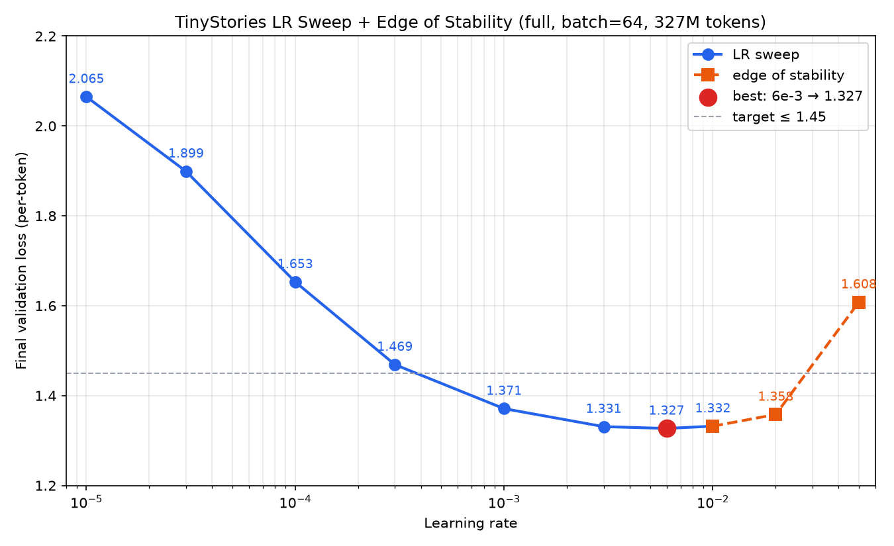

# Section 7 Experiments

TinyStories ~17M 参数 Transformer LM。实验分两轮：**g27 低资源**（41M tokens）和 **g52/g68 全量**（327M tokens，作业默认配置）。

---

## 作业 Deliverables 清单

本节对照手册要求，列出每项 deliverable、对应产物与完成状态。Learning curves 均在 [wandb cs336-section7](https://wandb.ai/steven144-nanjing-university/cs336-section7)（含 step 与 wall-clock time）。


| Problem                   | 分值  | 手册 Deliverable（摘要）                        | 我们的交付物                                 | 状态    |
| ------------------------- | --- | ----------------------------------------- | -------------------------------------- | ----- |
| **experiment_log**        | 3   | logging code + experiment log 文档          | `train.py` + 本文档                       | ✅     |
| **learning_rate (a)**     | 3   | LR curves + search strategy + val≤1.45 模型 | 全量 7 LR + **6e-3** ✅；最佳 `ts_bs64_lr6em3` val=**1.327** | ✅     |
| **learning_rate (b)**     | ↑   | 含 divergent run 的 LR curves + 分析          | 全量至 5e-2 未 NaN；ablation 无 RMSNorm@3e-3 发散 | ⚠️    |
| **batch_size_experiment** | 1   | batch curves + 讨论                         | 低资源 ✅；全量 bs16/64/128 + LR scaling ✅ | ✅     |
| **generate**              | 1   | ≥256 tokens dump + fluency + 2 因素         | `generate_full/` 7 组 decoding         | ✅     |
| **layer_norm_ablation**   | 1   | 无 RMSNorm curve + 评论                      | 低资源 ✅；全量 lr=3e-4/3e-3 ✅               | ✅     |
| **pre_norm_ablation**     | 1   | post-norm vs pre-norm curve               | 低资源 ✅；全量 lr=3e-4/3e-3 ✅               | ✅     |
| **no_pos_emb**            | 1   | RoPE vs NoPE curve                        | 低资源 ✅；全量 lr=3e-4/3e-3 ✅               | ✅     |
| **swiglu_ablation**       | 1   | SwiGLU vs SiLU curve + 讨论                 | 低资源 ✅；全量 lr=3e-4/3e-3 ✅               | ✅     |
| **main_experiment (OWT)** | 2   | OWT curve + 对比 + 生成分析                     | 训练 ✅ + 生成 ✅（`generate_owt/`）              | ✅     |


### 各 Problem 详细说明


#### Problem (experiment_log) — 实验日志基础设施

**手册 Deliverable（原文）：**

> Deliverable：用于实验的 logging infrastructure code，以及本节后续作业问题所需的 experiment log（记录你尝试过的所有事情的文档）。

**手册要求：**

- 创建 experiment tracking infrastructure，能相对 gradient steps 和 wall-clock time 跟踪 loss curves
- 提交 logging code + experiment log 文档

**交付：**

- Code：`train.py` 集成 wandb；`eval_interval` 周期性算 valid loss；log 含 `step`、`elapsed`（秒）
- Log：本文档 + wandb project `cs336-section7`

---


#### Problem (learning_rate) — 调 learning rate

**(a) Hyperparameter sweep**

**手册 Deliverable（原文）：**

> Deliverable：多个 learning rates 对应的 learning curves。解释你的 hyperparameter search strategy。  
> Deliverable：一个在 TinyStories 上 validation loss（per-token）不超过 1.45 的模型。

**手册要求：**

- 多个 LR 的 learning curves；说明 search strategy
- 一个 TinyStories 上 **validation loss（per-token）≤ 1.45** 的模型

**交付：**

- Search strategy：对数均匀扫描 `1e-5 … 1e-2`（7 点）；固定 batch=64；后续在 batch-LR 实验中补跑 **6e-3**（同配置，纳入 LR curve）
- **最佳模型（全量）：**


| 项目               | 值                                                    |
| ---------------- | ---------------------------------------------------- |
| Run（最佳）          | `ts_bs64_lr6em3`                                     |
| LR               | **6e-3**                                             |
| Final valid loss | **1.327**                                            |
| Checkpoint       | `experiments/section7/ts_bs64_lr6em3/checkpoint_final.pt` |
| 配置               | batch=64, 20k steps, 327M tokens, ~63 min            |


| 项目               | 值                                                    |
| ---------------- | ---------------------------------------------------- |
| Run（LR sweep 主扫） | `ts_lr3em3`                                          |
| LR               | 3e-3                                                 |
| Final valid loss | **1.331**                                            |
| Checkpoint       | `experiments/section7/ts_lr3em3/checkpoint_final.pt` |


| 项目               | 值                                                    |
| ---------------- | ---------------------------------------------------- |
| Run（默认 lr）       | `ts_lr3em4`                                          |
| LR               | 3e-4                                                 |
| Final valid loss | **1.469**                                            |
| Checkpoint       | `experiments/section7/ts_lr3em4/checkpoint_final.pt` |


- 低资源最佳 lr=3e-3（loss 1.690），未达 1.45，但满足 low-resource tip（≤2.0）

**(b) Edge of stability**

**手册 Deliverable（原文）：**

> Deliverable：逐渐增大 learning rate 的 learning curves，其中至少包含一个 divergent run，并分析这与 convergence rates 的关系。

**手册要求：**

- 逐渐增大 LR 的 curves，**至少一个 divergent run**
- 分析 divergent 点与最佳 LR 的关系

**交付：**

- 低资源：lr=5e-3、1e-2 均未发散
- 全量 baseline：lr 至 **5e-2**（`ts_lr_diverge_5em2`, val=1.608）仍无 NaN；2e-2（val=1.358）甚至接近最优
- 全量最佳 lr=3e-3（1.331）优于 1e-2（1.332），最优点不在 stability edge
- **相关 divergent 现象：** `ts_ablate_no_rmsnorm_lr3em3`（无 RMSNorm + lr=3e-3）训练后期 **loss→NaN**；说明 stability edge 与架构有关，baseline SwiGLU+pre-norm+RMSNorm 在 5e-2 仍稳定
- **缺口：** 严格意义上 baseline 模型无 divergent LR run；可引用 ablation NaN 或继续尝试 lr≥1e-1

---


#### Problem (batch_size_experiment) — Batch size

**手册 Deliverable（原文）：**

> Deliverable：不同 batch sizes 的 runs 对应的 learning curves。必要时应重新优化 learning rates。  
> Deliverable：用几句话讨论你关于 batch sizes 及其对训练影响的发现。

**手册要求：**

- batch 从 1 到 GPU 上限；至少包含 64、128 等
- 不同 batch 的 learning curves；必要时重调 LR
- 几句话讨论发现

**交付：**

- 低资源（41M tokens）：bs=1, 4, 16；结论见 7.2
- 全量（lr=3e-4）：bs64 **1.469**、bs16 **1.473**、bs128 **1.512**
- 全量 LR scaling：bs64@6e-3 **1.327**；bs128@6e-3/1e-2 **1.311**（优于 bs64@3e-4）
- bs=1/4 全量因步数过多已取消；低资源版仍可引用

---


#### Problem (generate) — 生成文本

**手册 Deliverable（原文）：**

> Deliverable：至少 256 tokens 的文本 dump（或直到第一个 `<|endoftext|>` token），并简要评论该输出的 fluency，以及至少两个影响输出好坏的因素。

**手册要求：**

- 用 decoder + trained checkpoint 生成文本
- ≥256 tokens（或至 `<|endoftext|>`）
- fluency 简评 + 至少两个影响因素

**交付：**

- 全量 checkpoint：`ts_lr3em3/checkpoint_final.pt`（val=1.331，g52 GPU 6）
- 文件：`experiments/section7/generate_full/generated_*.txt`（7 组 decoding 参数）
- 低资源对照：`experiments/section7/generated_lr3em3.txt`
- Code：`generate_text.py` + `cs336_basics/decoding.py`
- 评论：见 7.2 Generate Text

---


#### Problem (layer_norm_ablation) — 移除 RMSNorm

**手册 Deliverable（原文）：**

> Deliverable：移除 RMSNorms 后训练的 learning curve，以及最佳 learning rate 对应的 learning curve。  
> Deliverable：几句话评论 RMSNorm 的影响。

**手册要求：**

- 移除 RMSNorm 后的 learning curve
- 几句话评论 RMSNorm 影响（可否用更低 LR 稳定？）

**交付：**

- Run：`ts_ablate_no_rmsnorm`（lr=3e-4 / 3e-3）
- 低资源：1.840 vs baseline 1.832；训练未崩溃
- 全量 lr=3e-4：val=**1.483**（baseline 1.469）；lr=3e-3：训练后期 **NaN**（无法与 baseline 1.331 公平对比）
- **评论：** RMSNorm 对高 LR 训练稳定性至关重要；lr=3e-4 下移除 RMSNorm 仅略差（+0.014）

---


#### Problem (pre_norm_ablation) — Post-norm

**手册 Deliverable（原文）：**

> Deliverable：post-norm Transformer 的 learning curve，并与 pre-norm 对比。

**手册要求：**

- post-norm 的 learning curve，与 pre-norm 对比

**交付：**

- Run：`ts_ablate_post_norm`
- 低资源：post-norm 1.824 vs pre-norm 1.832（略好，差距小）
- 全量 lr=3e-4：val=**1.464**（−0.005）；lr=3e-3：val=**1.358**（baseline 1.331，+0.027）

---


#### Problem (no_pos_emb) — NoPE

**手册 Deliverable（原文）：**

> Deliverable：比较 RoPE 和 NoPE 表现的 learning curve。

**手册要求：**

- RoPE vs NoPE 的 learning curve 对比

**交付：**

- Run：`ts_ablate_no_rope`（NoPE）vs baseline（RoPE）
- 低资源：NoPE 1.926 vs RoPE 1.832
- 全量 lr=3e-4：val=**1.547**（+0.078）；lr=3e-3：val=**1.395**（+0.064）
- **评论：** RoPE 在全量下影响最大；NoPE 仍收敛但明显更差

---


#### Problem (swiglu_ablation) — SwiGLU vs SiLU

**手册 Deliverable（原文）：**

> Deliverable：在 parameter counts 大致匹配的情况下，比较 SwiGLU 和 SiLU feed-forward networks 性能的 learning curve。  
> Deliverable：几句话讨论你的发现。

**手册要求：**

- 参数量大致匹配下 SwiGLU vs SiLU 的 learning curves
- 几句话讨论

**交付：**

- Run：`ts_ablate_silu_ffn`（SiLU, d_ff=2048）vs baseline SwiGLU
- 低资源：SiLU 1.888 vs SwiGLU 1.832
- 全量 lr=3e-4：val=**1.492**（+0.023）；lr=3e-3：val=**1.341**（+0.010）
- **评论：** SwiGLU gating 有稳定收益；参数量匹配下 SiLU 略差

---


#### Problem (main_experiment) — OpenWebText

**手册 Deliverable（原文）：**

> Deliverable：你的 language model 在 OpenWebText 上的 learning curve。描述与 TinyStories 的 losses 差异；我们应如何解释这些 losses？  
> Deliverable：OpenWebText LM 生成的文本，格式与 TinyStories outputs 相同。该文本 fluency 如何？为什么即使使用与 TinyStories 相同的模型和 compute budget，输出质量仍更差？

**手册要求：**

- OWT 上同架构、同 iterations 的 learning curve
- 与 TinyStories losses 差异及解释
- OWT 生成文本 + fluency 分析（为何同 compute 质量更差）

**交付：** ✅ 完成

| 参数 | 值 |
|------|-----|
| Run | `owt_bs64_lr3em3_20000` |
| batch / lr | 64 / 3e-3 |
| max-iters | 20,000（327M tokens） |
| **final valid loss** | **3.985** @ step 19500 |
| wall time | ~**222 min**（13340s） |
| checkpoint | `experiments/section7/owt_bs64_lr3em3_20000/checkpoint_final.pt` |
| 生成样例 | `experiments/section7/generate_owt/` |
| wandb | [owt_bs64_lr3em3_20000](https://wandb.ai/steven144-nanjing-university/cs336-section7/runs/zn79v918) |

**Learning curve（valid loss 采样）：**

| step | OWT valid | TinyStories valid（`ts_lr3em3`） |
|------|-----------|----------------------------------|
| 0 | 10.39 | 9.25 |
| 500 | 5.71 | 2.53 |
| 4500 | 4.54 | 1.68 |
| 19500 | **3.99** | **1.33** |

**Loss 差异解释：**

- OWT 词表 32k，随机 baseline CE ≈ log(32000) ≈ **10.4**；实测 step 0 val=10.39。TinyStories step 0 val=9.25（词表 10k），OWT 起点略高且 **下降更慢**（500 step: 5.71 vs 2.53）
- OWT 文本更长尾、主题/语法更多样，17M 模型 + 327M tokens 仍严重 underfit（train loss ~4.0 仍高）
- 同 compute budget 下 OWT val 停留在 ~4.0，TS 可达 ~1.33——数值差主要来自 **任务难度 + 词表**，而非训练 bug

**生成与 fluency（prompt: `Once upon a time`）：**

| 配置 | fluency | 现象 |
|------|---------|------|
| t=0 greedy | ★☆☆ | 短句后陷入重复："the world is not a place to live" 循环 |
| t=0.8, p=0.95 | ★★☆ | 局部像新闻/对话，但人名、时间线、因果混乱（"Paul… Vietnam… gunman… 2007"） |
| t=1.0, p=0.95 | ★☆☆ | 主题漂移、乱码式 token 组合（"monkey plotting tree plots"） |

**为何同 compute 质量更差：**

1. **数据复杂度：** OWT 是真实 web 文本，需要 world knowledge + 长程依赖；TinyStories 是受限童话语域，模式简单
2. **Underfitting：** val≈4.0 说明模型对 OWT 仍接近「弱预测」；TS val≈1.33 已拟合较好
3. **Prompt 不匹配：** `Once upon a time` 偏童话，OWT 训练分布更偏新闻/论坛，greedy 易落入高频通用句式的重复

样例（greedy）见 `generate_owt/generated_t0_greedy.txt`；完整对比见 `generate_owt/` vs `generate_full/`。

~~`owt_bs64_lr3em3_80000`~~ 已在 step ~300 kill（预估 ~19 h > 6 h 上限）。

---


### Checkpoint 索引（交作业常用）


| 用途                             | 路径                                                   |
| ------------------------------ | ---------------------------------------------------- |
| **全量最佳模型**（lr=6e-3, val=1.327） | `experiments/section7/ts_bs64_lr6em3/checkpoint_final.pt` |
| 全量 LR sweep 最佳（lr=3e-3, val=1.331） | `experiments/section7/ts_lr3em3/checkpoint_final.pt` |
| 达标全量模型（lr=3e-4, val=1.469）     | `experiments/section7/ts_lr3em4/checkpoint_final.pt` |
| batch-LR 最佳（bs128@6e-3, val=1.311） | `experiments/section7/ts_bs128_lr6em3/checkpoint_final.pt` |
| OWT 模型 + 生成样例               | `experiments/section7/owt_bs64_lr3em3_20000/checkpoint_final.pt` + `generate_owt/` |
| 生成样例（低资源）                      | `experiments/section7/generated_lr3em3.txt`          |
| 生成样例（全量，7 组 decoding）          | `experiments/section7/generate_full/`                |


---


## Infrastructure


| 组件                 | 路径                                                                             |
| ------------------ | ------------------------------------------------------------------------------ |
| 训练                 | `train.py`                                                                     |
| 生成                 | `generate_text.py`                                                             |
| 启动器                | `run_section7.sh`, `run_section7_wave2.sh`, `run_section7_g52_wave2.sh`        |
| Checkpoints / logs | `experiments/section7/`（gitignored）                                            |
| 交付用图表              | `figures/section7/`                                                            |
| wandb              | [cs336-section7](https://wandb.ai/steven144-nanjing-university/cs336-section7) |
| wandb 命名工具         | `scripts/section7_names.sh`, `scripts/organize_wandb_section7.py`              |


### WandB 命名规范

Project 固定为 **`cs336-section7`**。本地 checkpoint 目录名保持不变（如 `ts_lr3em3`）；WandB 用 **group + 可读 run name** 分层，避免低资源/全量同名冲突。

**Group 格式：** `{dataset}/{tier}/{category}`

| category | 含义 | group 示例 |
|----------|------|------------|
| `lr_sweep` | LR 扫描 | `ts/full/lr_sweep` |
| `lr_diverge` | Edge of stability | `ts/full/lr_diverge` |
| `batch` | Batch size（固定 lr=3e-4） | `ts/low/batch` |
| `batch_lr` | Batch + LR scaling | `ts/full/batch_lr` |
| `ablation` | 架构消融 | `ts/full/ablation` |
| `baseline` | 重复 baseline | `ts/full/baseline` |
| `main` | OWT 主实验 | `owt/full/main` |

**tier：** `full`（327M tokens）vs `low`（41M tokens，`LOW_RESOURCE=1`）

**Run name 格式：**

| 实验类型 | 格式 | 示例 |
|----------|------|------|
| LR / batch | `bs{B}_lr{lr}` | `bs64_lr3e-3` |
| Ablation | `{variant}__bs{B}_lr{lr}` | `no_rope__bs64_lr3e-4` |
| OWT | `bs{B}_lr{lr}__{k}k` | `bs64_lr3e-3__20k` |

**旧名 → 新名对照（常见）：**

| 旧 wandb / checkpoint 名 | 新 group | 新 run name |
|--------------------------|----------|-------------|
| `ts_lr3em3`（全量） | `ts/full/lr_sweep` | `bs64_lr3e-3` |
| `ts_lr3em3`（低资源） | `ts/low/lr_sweep` | `bs16_lr3e-3` |
| `ts_lr_diverge_2em2` | `ts/full/lr_diverge` | `bs64_lr2e-2` |
| `ts_bs128_lr6em3` | `ts/full/batch_lr` | `bs128_lr6e-3` |
| `ts_ablate_no_rope_lr3em3` | `ts/full/ablation` | `no_rope__bs64_lr3e-3` |
| `owt_bs64_lr3em3_20000` | `owt/full/main` | `bs64_lr3e-3__20k` |

> `em` 后缀（如 `3em3` = `3e-3`）仅用于 **checkpoint 目录**，WandB 显示统一为 `3e-3`。

**整理已有 runs：**

```bash
# 预览
.venv/bin/python scripts/organize_wandb_section7.py

# 同步到 wandb 云端
.venv/bin/python scripts/organize_wandb_section7.py --apply
```


## 实验进度


| ID   | Problem             | g27 低资源          | g52/g68 全量                     |
| ---- | ------------------- | ---------------- | ------------------------------ |
| 7.1  | experiment_log      | ✅ wandb          | ✅ 同 project                    |
| 7.2a | learning_rate sweep | ✅ 7 runs         | ✅ 7 runs + **6e-3** 补跑          |
| 7.2b | edge of stability   | ✅ 2 runs         | ✅ 4 runs；baseline 无 NaN ⚠️     |
| 7.2  | batch_size          | ✅ bs=1/4/16      | ✅ bs16/64/128 + LR scaling      |
| 7.2  | generate            | ✅ 低资源 checkpoint | ✅ 全量 `ts_lr3em3` + 7 组 decoding |
| 7.3  | ablations           | ✅ 4 runs         | ✅ 8 runs（lr=3e-4/3e-3 各 4）    |
| 7.4  | OWT                 | ❌                | ✅ 训练 + 生成                         |


---


## 配置对照


| 参数             | 作业默认 / g52 全量   | g27 低资源                |
| -------------- | --------------- | ---------------------- |
| 机器             | g52 GPU 4–7     | g27 GPU 0–3（与 vLLM 共享） |
| tokens         | **327,680,000** | 40,960,000             |
| batch size     | **64**          | 16                     |
| max iters      | **20,000**      | 10,000                 |
| context length | 256             | 256                    |
| warmup         | **2,000**       | 1,000                  |
| val loss 目标    | ≤ **1.45**      | ≤ 2.00                 |
| 峰值显存           | ~8.9 GB         | ~2.3 GB                |


---


## 7.2a Learning Rate Sweep

**搜索策略**：对数均匀扫描 `1e-5 → 1e-2`（7 点），cosine decay 在训练结束时降至 min_lr=3e-5。固定 batch=64、20k steps。主扫完成后，在 batch-LR 实验中补跑 **6e-3**（`ts_bs64_lr6em3`，配置与 sweep 相同，纳入 LR curve）。

### g52 全量（batch=64, 20k steps）


| Run           | LR       | Final valid loss | Wall time          | 状态          |
| ------------- | -------- | ---------------- | ------------------ | ----------- |
| **ts_bs64_lr6em3** | **6e-3** | **1.327**   | ~63 min            | ✅ **全量最佳**（补跑） |
| **ts_lr3em3** | 3e-3     | 1.331            | ~62 min            | ✅ LR sweep   |
| ts_lr1em2     | 1e-2     | 1.332            | ~62 min            | ✅ 未发散       |
| ts_lr1em3     | 1e-3     | 1.371            | ~62 min            | ✅           |
| **ts_lr3em4** | 3e-4（默认） | **1.469**        | ~72 min            | ✅ 达标（≤1.45） |
| ts_lr1em4     | 1e-4     | 1.653            | ~72 min            | ✅           |
| ts_lr3em5     | 3e-5     | 1.899            | ~72 min            | ✅           |
| ts_lr1em5     | 1e-5     | 2.065            | ~72 min            | ✅           |


Wave 1（GPU 4–7）：1e-5 ~ 3e-4；Wave 2（GPU 4–6）：1e-3 ~ 1e-2；**6e-3** 在 batch-LR 阶段补跑（g52 GPU 6）。baseline 重复 run 已取消（`ts_lr3em4` 已足够）。

**结论：**

- 最优 LR 为 **6e-3**（val=**1.327**，`ts_bs64_lr6em3`），略优于 3e-3（1.331）和 1e-2（1.332）；最优点在 3e-3 ~ 1e-2 之间。
- Loss 随 LR 呈近似 U 型：1e-5（2.07）→ 6e-3（1.33）→ 1e-2（1.33）；继续增大至 2e-2（1.36）、5e-2（1.61）仍无 NaN，见 7.2b。
- 默认 lr=3e-4（1.469）已满足作业 ≤1.45；若追求更好 checkpoint 用 `ts_bs64_lr6em3` 或 `ts_lr3em3`。



> 图：`figures/section7/lr_sweep_full.png`（蓝线 = LR sweep + 6e-3 补跑；橙虚线 = 7.2b diverge 2e-2/5e-2；脚本 `scripts/plot_lr_sweep.py`）


### g27 低资源（batch=16, 10k steps, ~10 min/run）


| Run                | LR       | Final valid loss | Wall time | 备注       |
| ------------------ | -------- | ---------------- | --------- | -------- |
| **ts_lr3em3**      | **3e-3** | **1.690**        | ~925s     | 低资源最佳    |
| ts_lr1em3          | 1e-3     | 1.697            | ~517s     |          |
| ts_lr_diverge_5em3 | 5e-3     | 1.713            | ~527s     | 未发散      |
| ts_lr1em2          | 1e-2     | 1.766            | ~927s     | 未发散      |
| ts_lr3em4          | 3e-4     | 1.832            | ~594s     | baseline |
| ts_lr1em4          | 1e-4     | 2.128            | ~594s     |          |
| ts_lr3em5          | 3e-5     | 2.469            | ~594s     |          |
| ts_lr1em5          | 1e-5     | 2.669            | ~594s     |          |


### 低资源 vs 全量对比（相同 LR）


| LR   | 低资源 valid loss | 全量 valid loss | Δ     |
| ---- | -------------- | ------------- | ----- |
| 1e-2 | 1.766          | 1.332         | −0.43 |
| 3e-3 | 1.690          | **1.331**     | −0.36 |
| 1e-3 | 1.697          | 1.371         | −0.33 |
| 3e-4 | 1.832          | 1.469         | −0.36 |
| 1e-4 | 2.128          | 1.653         | −0.48 |
| 3e-5 | 2.469          | 1.899         | −0.57 |
| 1e-5 | 2.669          | 2.065         | −0.60 |


全量训练（8× tokens + 4× batch）对所有 LR 均有大幅提升。低资源最优 LR（3e-3）在全量下仍为最优或接近最优。

---


## 7.2b Edge of Stability

与 7.2a 同一配置（全量 bs=64、20k steps），在 sweep 范围外继续增大 LR。**曲线见上方 LR sweep 图（橙虚线）。**

| Run                | 配置     | LR   | Final valid loss | Wall time | 是否发散 |
| ------------------ | ------ | ---- | ---------------- | --------- | ---- |
| ts_lr_diverge_5em3 | 低资源    | 5e-3 | 1.713            | ~9 min    | 否    |
| ts_lr_diverge_1em2 | 低资源    | 1e-2 | 1.766            | ~15 min   | 否    |
| ts_lr1em2          | **全量** | 1e-2 | 1.332            | ~62 min   | 否（=sweep 末点） |
| ts_lr_diverge_2em2 | **全量** | 2e-2 | **1.358**        | ~73 min   | 否    |
| ts_lr_diverge_5em2 | **全量** | 5e-2 | **1.608**        | ~73 min   | 否（变差但未 NaN） |
| ts_ablate_no_rmsnorm_lr3em3 | 全量 ablation | 3e-3 | **NaN** | ~68 min | **是** |

**全量 LR → val 序列（含 sweep）：** 1e-5（2.07）→ … → 6e-3（**1.327**）→ 1e-2（1.33）→ 2e-2（1.36）→ 5e-2（1.61）


- 低资源：最优 3e-3（1.690）优于 5e-3 和 1e-2；1e-2 有过拟合迹象（train 1.64 vs valid 1.77）。
- 全量 baseline：LR 至 5e-2 仍无 NaN；2e-2 甚至 val=1.358 接近最优 1.331，说明 baseline 架构 stability margin 很大。
- 5e-2 时 valid 升至 1.608，loss 曲线可观察到 degradation，但非 handbook 意义的 divergent（无爆炸/NaN）。
- **唯一 NaN：** 移除 RMSNorm + lr=3e-3（`ts_ablate_no_rmsnorm_lr3em3`），说明 normalization 对高 LR 稳定性至关重要。

---


## 7.2 Batch Size Experiment

仅低资源配置（~41M tokens, lr=3e-4）：


| Run     | Batch | Iters   | Final valid loss | Wall time |
| ------- | ----- | ------- | ---------------- | --------- |
| ts_bs16 | 16    | 10,000  | 1.832            | ~517s     |
| ts_bs4  | 4     | 39,500  | 1.925            | ~972s     |
| ts_bs1  | 1     | 159,500 | 2.285            | ~2828s    |


batch 越大越好（低资源）。全量结果（327M tokens）：

| Run | Batch | LR | Final valid loss | Wall time | 状态 |
|-----|-------|-----|-----------------|-----------|------|
| `ts_lr3em4` / `ts_bs64` | 64 | 3e-4 | 1.469 | ~73 min | ✅ baseline |
| **`ts_bs64_lr6em3`** | 64 | **6e-3** | **1.327** | ~63 min | ✅ |
| **`ts_bs16`** | 16 | 3e-4 | **1.473** | ~101 min | ✅ 80k steps |
| `ts_bs128` | 128 | 3e-4 | 1.512 | ~63 min | ✅ |
| **`ts_bs128_lr6em3`** | 128 | **6e-3** | **1.311** | ~61 min | ✅ 最佳 |
| `ts_bs128_lr1em2` | 128 | 1e-2 | 1.312 | ~61 min | ✅ |
| `ts_bs128_lr3em3` | 128 | 3e-3 | 1.324 | ~61 min | ✅ |
| `ts_bs128_lr2em2` | 128 | 2e-2 | 1.325 | ~61 min | ✅ |

**讨论要点：**
- 固定 token budget、lr=3e-4：bs16 **1.473** ≈ bs64 **1.469** > bs128 **1.512**；小 batch 并非更差
- bs128@3e-4 差于 bs64，**线性 LR scaling**（×2 batch → ×2 LR）有效：6e-3 时 bs128 **1.311** 优于 bs64@3e-4
- 固定 token budget 下 bs128 wall time 仅比 bs64 快 ~14%（非 2×），因每 step 计算量更大
- bs16 需 80k steps、~101 min，最慢；bs128@6e-3 质量最佳且 ~61 min

---


## 7.2 Generate Text

**Prompt**：`Once upon a time`  
**Checkpoint（全量）**：`ts_lr3em3/checkpoint_final.pt`（327M tokens，val=**1.331**）  
**运行**：g52 GPU 6，2026-07-24

### Decoding 参数对比（全量模型）


| 配置 | temperature | top_p | fluency | 备注 |
| ---- | ----------- | ----- | ------- | ---- |
| t0_greedy | 0 | — | ★★★★ | 最连贯，情节完整（Lily + Mr. Bear），无语法错误 |
| t05_p095 | 0.5 | 0.95 | ★★★★ | 与 greedy 类似，略有多样性 |
| t08_p095 | 0.8 | 0.95 | ★★★★ | 故事完整（Sue + shell），对话自然 |
| t08_p09 | 0.8 | 0.9 | ★★★☆ | 略保守，"weigh the leaves" 语义略怪 |
| t08_p099 | 0.8 | 0.99 | ★★★★ | 与 t08_p095 接近，情节合理 |
| t10_p095 | 1.0 | 0.95 | ★★★☆ | 出现 "strike the stick with their sticks" 等重复 |
| t12_p095 | 1.2 | 0.95 | ★★☆ | 语义崩坏（"I like your fears"、"replaced flow"） |


**推荐配置**：temperature=0~0.8, top_p=0.9~0.95。全量模型明显优于低资源（逻辑更连贯、重复更少）。

**影响输出质量的两个因素**：

1. **Temperature**：越低越 deterministic，连贯性越好；≥1.2 时小模型易出现 nonsense token 组合。
2. **Top-p (nucleus)**：在 temperature=0.8 下，0.9 vs 0.99 差异不大；主要影响来自 temperature 本身。

### 全量最佳样例（t0 greedy, temperature=0）

```
Once upon a time, there was a little girl named Lily. She had a big, soft teddy bear named Mr. Bear. Lily loved Mr. Bear very much. They played together every day.
One day, Lily and Mr. Bear went to the park. They played on the swings and the slide. Lily was very happy. But then, a big wind came and blew Mr. Bear away. Lily was very sad.
Lily looked for Mr. Bear everywhere. She asked her friends to help her find him. They all looked for Mr. Bear. At last, they found him under a big tree. Lily was so happy to have her bear back. She hugged Mr. Bear and said, "Thank you for helping me find my bear!"
<|endoftext|>
```

完整输出目录：`experiments/section7/generate_full/`  
低资源对照：`experiments/section7/generated_lr3em3.txt`（temperature=0.8, top_p=0.95，有 cake mix 重复）

---


## 7.3 Ablations

### 低资源（lr=3e-4, batch=16, 10k steps）


| Run                  | 改动                   | Final valid loss | vs baseline (1.832) |
| -------------------- | -------------------- | ---------------- | ------------------- |
| ts_ablate_post_norm  | pre-norm → post-norm | 1.824            | −0.008              |
| ts_ablate_no_rmsnorm | 移除 RMSNorm           | 1.840            | +0.008              |
| ts_ablate_silu_ffn   | SwiGLU → SiLU        | 1.888            | +0.056              |
| ts_ablate_no_rope    | 移除 RoPE              | 1.926            | +0.094              |


### 全量 lr=3e-4（batch=64, 20k steps；baseline RoPE+pre-norm+RMSNorm+SwiGLU val=**1.469**）


| Run                  | 改动           | Final valid loss | Δ vs baseline |
| -------------------- | ------------ | ---------------- | ------------- |
| ts_ablate_post_norm  | post-norm    | **1.464**        | −0.005        |
| ts_ablate_no_rmsnorm | 无 RMSNorm    | **1.483**        | +0.014        |
| ts_ablate_silu_ffn   | SiLU FFN     | **1.492**        | +0.023        |
| ts_ablate_no_rope    | NoPE         | **1.547**        | +0.078        |


### 全量 lr=3e-3（batch=64, 20k steps；baseline val=**1.331**）


| Run                  | 改动           | Final valid loss | Δ vs baseline | 备注        |
| -------------------- | ------------ | ---------------- | ------------- | --------- |
| ts_ablate_silu_ffn   | SiLU FFN     | **1.341**        | +0.010        | ✅         |
| ts_ablate_post_norm  | post-norm    | **1.358**        | +0.027        | ✅         |
| ts_ablate_no_rope    | NoPE         | **1.395**        | +0.064        | ✅         |
| ts_ablate_no_rmsnorm | 无 RMSNorm    | **NaN**          | —             | 训练崩溃 ⚠️ |


**结论：**

- **RoPE** 影响最大（全量 +0.06~0.08）；NoPE 仍收敛但明显更差
- **SwiGLU** gating 有稳定收益（+0.01~0.02）；SiLU 参数量匹配下略差
- **RMSNorm**：lr=3e-4 下移除仅 +0.014；lr=3e-3 下移除导致 **NaN**——normalization 是高 LR 训练的关键
- **post-norm vs pre-norm**：差异很小（≤0.03），低资源甚至 post-norm 略好

---


## 7.4 OpenWebText

**Run：** `owt_bs64_lr3em3_20000`（g68 GPU 0，2026-07-24，~222 min）

| 参数 | TinyStories 最佳 | OWT |
|------|-----------------|-----|
| 词表 | 10,000 | 32,000 |
| tokens | 327M | 327M |
| batch / lr | 64 / 3e-3 | 64 / 3e-3 |
| final valid loss | **1.331** | **3.985** |
| 状态 | ✅ | ✅ |

详见上方 **Problem (main_experiment)** 的 loss 对比、生成样例与 fluency 分析。

**生成命令：**

```bash
CKPT=experiments/section7/owt_bs64_lr3em3_20000/checkpoint_final.pt
CUDA_VISIBLE_DEVICES=0 .venv/bin/python generate_text.py \
  --checkpoint $CKPT \
  --vocab-file data/owt_vocab.json --merges-file data/owt_merges.txt \
  --vocab-size 32000 --temperature 0 --top-p 0.95 \
  --output experiments/section7/generate_owt/generated_t0_greedy.txt
```

---


## 全量实验完成摘要（2026-07-24 更新）

以下 g52/g68/g26/g32 任务均已跑完：


| 类别 | Runs | 状态 |
|------|------|------|
| LR sweep（7 + 6e-3） | `ts_lr*` + `ts_bs64_lr6em3` | ✅ |
| LR diverge（2 全量） | `ts_lr_diverge_2em2`, `ts_lr_diverge_5em2` | ✅ |
| Batch size（3 + 5 LR scaling） | `ts_bs16`, `ts_bs128`, `ts_bs64_lr6em3`, `ts_bs128_lr*` | ✅ |
| Ablation lr=3e-4（4） | `ts_ablate_*` | ✅ |
| Ablation lr=3e-3（4） | `ts_ablate_*_lr3em3` | ✅（no_rmsnorm NaN） |
| **OWT** | `owt_bs64_lr3em3_20000` + `generate_owt/` | ✅ |

---


## 机器分工摘要


| 机器  | 任务                            | 状态     |
| --- | ----------------------------- | ------ |
| g27 | 低资源 LR / batch / ablation     | ✅ 完成   |
| g52 | 全量 LR sweep wave1+2           | ✅ 完成   |
| g52 | diverge 2e-2 / 5e-2             | ✅ 完成   |
| g52 | batch-lr bs64@6e-3, bs128@1e-2 | ✅ 完成   |
| g68 | batch-lr bs128 sweep            | ✅ 完成   |
| g68 | ablation lr=3e-4（×4）            | ✅ 完成   |
| g26 | ablation lr=3e-3（×3）            | ✅ 完成   |
| g32 | ablation silu lr=3e-3           | ✅ 完成   |
| g68 | OWT 20k steps + generate          | ✅ 完成   |


注意：全量 run 与低资源 run **同名**，`experiments/section7/ts_lr`* 的 checkpoint 已被全量结果覆盖（低资源数值保留在本文档和 wandb 历史 run 中）。

---


## 复现命令

```bash
# 低资源
LOW_RESOURCE=1 ./run_section7.sh lr-sweep 0 0 1 2 3

# 全量（需 ~10GB 空闲显存）
./run_section7.sh lr-sweep 0 4 5 6 7

# 文本生成（全量最佳，g52）
CKPT=experiments/section7/ts_lr3em3/checkpoint_final.pt
CUDA_VISIBLE_DEVICES=6 .venv/bin/python generate_text.py \
  --checkpoint $CKPT --temperature 0 --top-p 0.95 \
  --output experiments/section7/generate_full/generated_t0_greedy.txt
# 其他 decoding 组合见 generate_full/ 目录

# OWT（327M tokens = 20k steps）
./run_section7.sh owt <gpu> --batch-size 64 --max-iters 20000 --lr 3e-3

# Batch-LR scaling 示例
./run_section7.sh batch-lr 128 4:6e-3 5:3e-3 6:1e-2

# Ablation（lr=3e-3）
./run_section7.sh ablations --lr 3e-3 0 1 2 3
```


## 已知问题

- `generate_text.py` 最初用 `torch.optim.AdamW` 加载 checkpoint 会失败（自定义 AdamW state 格式不同），已改为只加载 model weights。
- `run_section7_wave2.sh` 的 diverge 段有重复启动逻辑，不影响 checkpoint 有效性。
- g82/g83/g85（glibc 2.17）无法运行当前 `.venv`；g26 为 glibc 2.35，环境正常。

